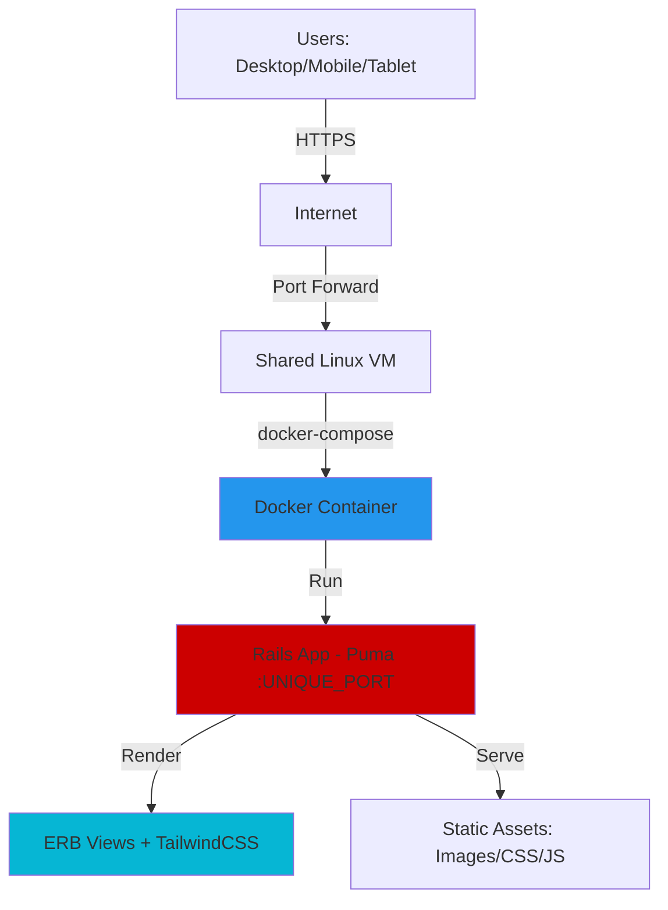
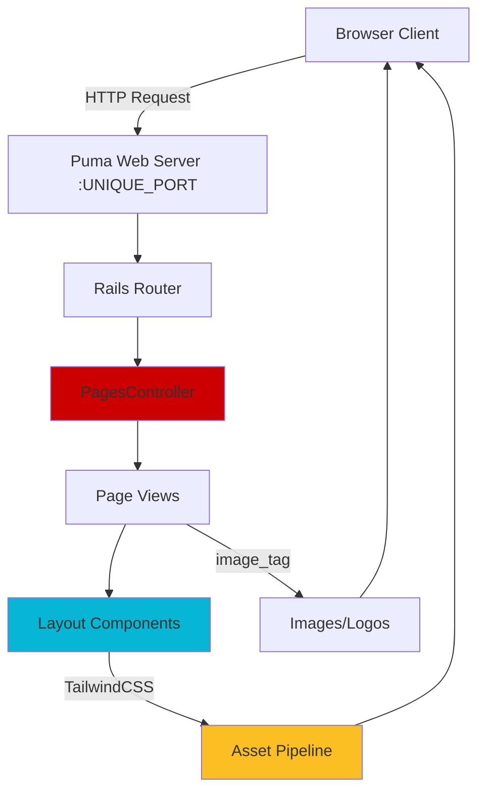

# Infinity Global Fullstack Architecture Document

## Introduction

This document outlines the complete architecture for the **Infinity Global** consulting website, a static server-side rendered Rails application with TailwindCSS styling and Docker deployment. It serves as the single source of truth for development, ensuring consistency across the technology stack.

This is a simplified architecture appropriate for a marketing website with no database, no API layer, and no client-side JavaScript framework - focusing on fast, SEO-friendly server-rendered pages with modern responsive styling.

### Starter Template or Existing Project

**N/A - Greenfield Project**

This is a new Rails 7.x application built from scratch using `rails new`. No starter template or existing codebase is being used. All architectural decisions will be made fresh based on PRD requirements.

### Change Log

| Date | Version | Description | Author |
|------|---------|-------------|--------|
| 2025-10-29 | 0.1 | Initial architecture draft | Winston (Architect) |

---

## High Level Architecture

### Technical Summary

The Infinity Global website is a **monolithic Ruby on Rails 7.x application** using **server-side rendering** with ERB templates and **TailwindCSS** for modern responsive styling. The application requires **no database** (static content in views/partials) and **no client-side JavaScript framework** (minimal JavaScript for mobile menu only). The architecture prioritizes **fast page loads** (<2 seconds on 3G), **SEO-friendly server rendering**, and **simple deployment** via Docker Compose to a shared VM using a unique port. This straightforward architecture delivers a professional marketing website with five static pages optimized for lead generation and credibility.

### Platform and Infrastructure Choice

Based on the PRD requirements for Docker deployment on a shared VM with unique port configuration, the platform choice is straightforward:

**Platform:** Self-hosted on shared Linux VM (Docker-based deployment)

**Key Services:**
- **Ruby on Rails 7.x** (Puma web server) - Application framework
- **Docker & Docker Compose** - Containerization and orchestration
- **TailwindCSS** (via tailwindcss-rails or standalone) - CSS framework
- **Let's Encrypt** - SSL/TLS certificates for HTTPS
- **Optional: Nginx** - Reverse proxy if VM requires it

**Deployment Host and Regions:** Single VM deployment (region to be determined by stakeholder's hosting provider)

**Rationale:** The PRD explicitly requires Docker Compose deployment to a shared VM. This eliminates platform options like Vercel, Netlify, or AWS Amplify. The self-hosted approach provides:
- **Cost efficiency**: No platform fees, runs on existing infrastructure
- **Deployment control**: Unique port configuration prevents conflicts with other apps on shared VM
- **Simplicity**: No complex cloud services needed for static content
- **Security**: Let's Encrypt provides free SSL certificates

### Repository Structure

**Structure:** Monorepo (single repository)

**Monorepo Tool:** Not applicable - standard Rails application structure

**Package Organization:** Standard Rails MVC structure with all code, assets, and configuration in a single repository. No need for multi-package organization since there's no separate frontend app, API, or shared libraries.

**Rationale:** A marketing website with 5 static pages doesn't benefit from monorepo tooling (Nx, Turborepo). Standard Rails structure provides:
- **Simplicity**: Single `rails new` command creates entire structure
- **Convention over configuration**: Rails defaults handle asset pipeline, routing, views
- **Developer familiarity**: Standard Rails patterns are well-documented
- **Deployment ease**: Single Docker image contains entire application

### High Level Architecture Diagram



### Architectural Patterns

- **Monolithic Architecture:** Single Rails application handling all concerns (routing, rendering, assets) - _Rationale:_ Simplest architecture for static marketing site with no complex business logic or scaling requirements

- **Server-Side Rendering (SSR):** All HTML generated on server via ERB templates - _Rationale:_ Optimal for SEO, fast initial page load, and no JavaScript complexity; aligns with NFR4 requirement

- **MVC Pattern:** Rails Model-View-Controller structure (Controllers + Views only, no Models) - _Rationale:_ Leverages Rails conventions; no models needed since there's no database

- **Responsive Design:** Mobile-first TailwindCSS utility classes - _Rationale:_ Meets NFR1 mobile-friendly requirement and provides modern, maintainable styling

- **Static Content Pattern:** Content embedded directly in views/partials rather than database - _Rationale:_ Content changes infrequently; no database overhead simplifies deployment and improves performance

- **Containerized Deployment:** Docker + Docker Compose for isolated, reproducible deployments - _Rationale:_ Meets NFR3 requirement for shared VM deployment with port isolation

---

## Tech Stack

This is the **DEFINITIVE** technology selection for the entire project. All development must use these exact technologies and versions.

### Technology Stack Table

| Category | Technology | Version | Purpose | Rationale |
|----------|-----------|---------|---------|-----------|
| **Backend Language** | Ruby | 3.3.x | Server-side application logic | Latest stable Ruby with performance improvements; YJIT JIT compiler for 20-40% speed boost |
| **Backend Framework** | Ruby on Rails | 7.2.x | Web application framework | Latest stable Rails with modern asset pipeline (Propshaft default); excellent for server-side rendering |
| **Web Server** | Puma | 6.x (bundled) | HTTP server | Rails default; production-ready, multi-threaded, handles concurrent requests efficiently |
| **CSS Framework** | TailwindCSS | 3.4.x | Utility-first CSS framework | PRD requirement; mobile-first responsive design, PurgeCSS for minimal bundle size |
| **Tailwind Integration** | tailwindcss-rails | 2.x | Rails + Tailwind integration | Official gem; integrates Tailwind CLI with Rails asset pipeline, auto-recompilation in dev |
| **Templating** | ERB | Built-in | Server-side HTML templates | Rails default; simple, no learning curve, sufficient for static content |
| **Asset Pipeline** | Propshaft | Built-in Rails 7 | Asset serving and compilation | Rails 7 default; simpler than Sprockets, sufficient for non-compiled assets |
| **JavaScript Runtime** | Node.js | 20.x LTS | Tailwind CLI dependency | Required for TailwindCSS standalone CLI; LTS version for stability |
| **Package Manager** | Bundler | 2.5.x | Ruby gem management | Rails standard; lockfile ensures reproducible builds |
| **Database** | None | N/A | No database required | Static content in views; simplifies deployment per NFR5 |
| **Cache** | None | N/A | No caching layer needed | Marketing site traffic doesn't warrant Redis/Memcached complexity |
| **File Storage** | Local Filesystem | N/A | Images and static assets | Logos and stock photos stored in `app/assets/images` or `public/` |
| **Authentication** | None | N/A | No user authentication | Public marketing site with no login functionality |
| **Frontend Testing** | N/A | N/A | No frontend JS framework | Minimal JavaScript doesn't warrant Jest/Vitest setup |
| **Backend Testing** | RSpec | 3.13.x | Rails testing framework | Industry standard; better syntax than Minitest, strong community support |
| **Integration Testing** | Capybara | 3.40.x | Browser automation for tests | Simulates user interactions; tests navigation, responsive design, link functionality |
| **E2E Testing** | RSpec + Capybara | Same as above | Full user journey testing | Combined with RSpec for end-to-end flows (homepage → contact) |
| **Test Coverage** | SimpleCov | 0.22.x | Code coverage reporting | Tracks test coverage; aim for >80% per PRD testing requirements |
| **Build Tool** | Rails CLI | Built-in | Asset compilation | `rails assets:precompile` handles TailwindCSS compilation and asset bundling |
| **Bundler** | esbuild | Optional | JavaScript bundling (minimal) | Only if needed for mobile menu JS; Propshaft may be sufficient |
| **Containerization** | Docker | 24.x+ | Application containerization | PRD requirement (NFR3); reproducible builds, dependency isolation |
| **Orchestration** | Docker Compose | 2.x | Multi-container orchestration | PRD requirement; simplifies single-container deployment with env vars |
| **IaC Tool** | None | N/A | No infrastructure-as-code | Simple single-VM deployment doesn't require Terraform/Pulumi |
| **CI/CD** | GitHub Actions | N/A | Automated testing and deployment | Optional per Story 4.6; free for public repos, good Rails support |
| **Monitoring** | None (MVP) | N/A | Application monitoring | Can add Sentry/Rollbar post-launch; not required for MVP |
| **Logging** | Rails Logger | Built-in | Application logging | Default `log/production.log`; sufficient for MVP, can ship to external service later |
| **HTTP Client** | None | N/A | No external API calls | Static site with no third-party integrations |
| **Mobile Menu JS** | Stimulus | 3.x (optional) | Minimal JavaScript framework | If needed for hamburger menu; Hotwire project, pairs well with Rails |

---

## Components

Since this is a static Rails application with no database or API, the component architecture is simplified. Components represent logical groupings of Rails MVC elements and supporting infrastructure.

### PagesController

**Responsibility:** Handle routing and rendering for all static pages (Home, About, Contact, Terms, Privacy)

**Key Interfaces:**
- `GET /` → `pages#home`
- `GET /about` → `pages#about`
- `GET /contact` → `pages#contact`
- `GET /terms` → `pages#terms`
- `GET /privacy` → `pages#privacy`

**Dependencies:** None (no database, no services)

**Technology Stack:**
- Rails routing (`config/routes.rb`)
- PagesController (`app/controllers/pages_controller.rb`)
- ERB views (`app/views/pages/*.html.erb`)
- No business logic - controllers simply render views

### Layout Components

**Responsibility:** Provide consistent header, footer, and application layout across all pages

**Key Interfaces:**
- `app/views/layouts/application.html.erb` → Main layout wrapper
- `app/views/shared/_header.html.erb` → Navigation header partial
- `app/views/shared/_footer.html.erb` → Footer partial

**Dependencies:** TailwindCSS for styling, optional JavaScript for mobile menu

**Technology Stack:**
- ERB partials for reusable components
- TailwindCSS utility classes for responsive design
- Rails `render partial:` helper for inclusion

### Asset Pipeline

**Responsibility:** Compile TailwindCSS, serve images/logos, handle favicon

**Key Interfaces:**
- `app/assets/stylesheets/application.tailwind.css` → TailwindCSS entry point
- `app/assets/images/` → Logos and stock photography
- `public/` → Compiled assets and static files (favicon, robots.txt, sitemap.xml)

**Dependencies:**
- tailwindcss-rails gem
- Node.js for Tailwind CLI
- Propshaft asset pipeline

**Technology Stack:**
- TailwindCSS compilation via `bin/rails tailwindcss:build`
- Image optimization (manual or via ImageMagick)
- Asset fingerprinting for cache busting in production

### Docker Deployment Container

**Responsibility:** Encapsulate Rails application and dependencies for reproducible deployment

**Key Interfaces:**
- `Dockerfile` → Multi-stage build definition
- `docker-compose.yml` → Container orchestration
- `.env` → Environment variable configuration (PORT, SECRET_KEY_BASE)

**Dependencies:**
- Docker Engine 24.x+
- Docker Compose 2.x
- VM with available port

**Technology Stack:**
- Base image: `ruby:3.3-alpine` (lightweight)
- Multi-stage build: Builder stage + production stage
- Puma server exposed on configurable port

### Error Handling Component

**Responsibility:** Render user-friendly error pages (404, 500)

**Key Interfaces:**
- `public/404.html` → Not Found page (static HTML with header/footer styling)
- `public/500.html` → Server Error page (static HTML)

**Dependencies:** TailwindCSS classes (inlined or minimal CSS)

**Technology Stack:**
- Static HTML files served by Rails for error pages
- Consistent branding with header/footer (simplified versions)

---

### Component Diagram



---

## Project Structure

```
infinityglobal/
├── .github/                           # GitHub-specific files
│   └── workflows/                     # CI/CD workflows (optional)
│       ├── ci.yml                     # Run tests on PR
│       └── deploy.yml                 # Deploy to production
│
├── app/                               # Main Rails application
│   ├── assets/
│   │   ├── images/                    # Images, logos, stock photos
│   │   │   ├── logo.png               # Company logo (no text)
│   │   │   ├── logo-with-name.png     # Logo with company name
│   │   │   ├── hero-background.jpg    # Homepage hero image
│   │   │   ├── about-team.jpg         # About page images
│   │   │   └── favicon.ico            # Favicon (also copied to public/)
│   │   └── stylesheets/
│   │       └── application.tailwind.css  # TailwindCSS entry point
│   │
│   ├── controllers/
│   │   ├── application_controller.rb  # Base controller
│   │   └── pages_controller.rb        # Static pages controller
│   │
│   ├── helpers/
│   │   ├── application_helper.rb      # Global helpers
│   │   └── pages_helper.rb            # Page-specific helpers (e.g., active_link)
│   │
│   ├── javascript/                    # Minimal JavaScript (if needed)
│   │   ├── application.js             # Main JS entry
│   │   └── controllers/               # Stimulus controllers (optional)
│   │       └── menu_controller.js     # Mobile menu toggle (if not pure CSS)
│   │
│   └── views/
│       ├── layouts/
│       │   └── application.html.erb   # Main layout template
│       ├── shared/
│       │   ├── _header.html.erb       # Header partial with nav + CTA
│       │   └── _footer.html.erb       # Footer partial with links + copyright
│       └── pages/
│           ├── home.html.erb          # Homepage (hero, services, credibility)
│           ├── about.html.erb         # About Us page
│           ├── contact.html.erb       # Contact Us page
│           ├── terms.html.erb         # Terms of Service
│           └── privacy.html.erb       # Privacy Policy
│
├── bin/                               # Executable scripts
│   ├── rails                          # Rails CLI
│   ├── setup                          # Initial project setup
│   └── docker-entrypoint              # Docker container startup script
│
├── config/                            # Configuration files
│   ├── routes.rb                      # Route definitions
│   ├── application.rb                 # Application configuration
│   ├── environments/
│   │   ├── development.rb
│   │   ├── test.rb
│   │   └── production.rb              # Production config (asset compilation, logging)
│   ├── initializers/
│   │   └── content_security_policy.rb # Security headers
│   └── puma.rb                        # Puma web server config
│
├── db/                                # Database directory (empty - no DB used)
│   └── .gitkeep                       # Keep directory in git
│
├── lib/                               # Custom library code (if needed)
│   └── tasks/                         # Custom Rake tasks
│
├── log/                               # Application logs
│   ├── development.log
│   └── production.log
│
├── public/                            # Static files served directly
│   ├── 404.html                       # Not Found error page
│   ├── 500.html                       # Server Error page
│   ├── favicon.ico                    # Favicon (copied from assets)
│   ├── robots.txt                     # Search engine crawler rules
│   └── sitemap.xml                    # SEO sitemap
│
├── spec/                              # RSpec tests
│   ├── spec_helper.rb                 # RSpec configuration
│   ├── rails_helper.rb                # Rails-specific test setup
│   ├── controllers/
│   │   └── pages_controller_spec.rb   # Controller tests
│   ├── features/                      # Integration tests (Capybara)
│   │   ├── homepage_spec.rb           # Homepage user flow
│   │   ├── navigation_spec.rb         # Navigation between pages
│   │   └── contact_page_spec.rb       # Contact page links
│   └── views/
│       └── pages/                     # View rendering tests
│
├── tmp/                               # Temporary files (cache, pids, sockets)
│   └── .gitkeep
│
├── vendor/                            # Third-party code (empty for this project)
│
├── .dockerignore                      # Files to exclude from Docker build
├── .env.example                       # Environment variable template
├── .gitignore                         # Git ignore rules
├── .ruby-version                      # Ruby version (3.3.0)
├── Dockerfile                         # Docker image definition
├── docker-compose.yml                 # Docker Compose orchestration
├── Gemfile                            # Ruby dependencies
├── Gemfile.lock                       # Locked dependency versions
├── package.json                       # Node dependencies (Tailwind CLI)
├── package-lock.json                  # Locked Node dependency versions
├── Procfile                           # Process definitions (for Heroku-style deployment)
├── Rakefile                           # Rake task definitions
├── README.md                          # Project documentation
└── tailwind.config.js                 # TailwindCSS configuration
```

---

## Development Workflow

### Local Development Setup

#### Prerequisites

```bash
# Install Ruby 3.3.x (via rbenv, rvm, or asdf)
rbenv install 3.3.0
rbenv global 3.3.0

# Install Node.js 20.x LTS (for TailwindCSS CLI)
# Via nvm:
nvm install 20
nvm use 20

# Install Docker and Docker Compose
# macOS: Docker Desktop
# Linux: sudo apt-get install docker.io docker-compose
# Verify:
docker --version  # Should be 24.x+
docker-compose --version  # Should be 2.x+

# Install Bundler
gem install bundler
```

#### Initial Setup

```bash
# Clone repository
git clone <repository-url>
cd infinityglobal

# Install Ruby dependencies
bundle install

# Install Node dependencies (for TailwindCSS)
npm install

# Copy environment variables template
cp .env.example .env

# Edit .env and set unique port (e.g., PORT=3847)
# Generate Rails secret: rails secret
# Add to .env: SECRET_KEY_BASE=<generated-secret>

# Setup database (no-op since we have no database)
# This command exists for Rails conventions but does nothing
bin/rails db:setup  # Will skip database setup

# Build TailwindCSS (initial compilation)
bin/rails tailwindcss:build

# Verify setup
bin/rails --version  # Should show Rails 7.2.x
```

#### Development Commands

```bash
# Start Rails server (development mode)
bin/rails server
# Access at: http://localhost:3000

# Start with TailwindCSS auto-recompilation (recommended)
bin/dev
# This runs both Puma and Tailwind watcher (uses Procfile.dev)

# Run TailwindCSS watcher separately (in another terminal)
bin/rails tailwindcss:watch

# Run Rails console (IRB with Rails environment)
bin/rails console

# Run tests
bundle exec rspec

# Run specific test file
bundle exec rspec spec/features/homepage_spec.rb

# Run tests with coverage
COVERAGE=true bundle exec rspec

# Lint Ruby code (if RuboCop installed)
bundle exec rubocop

# Build assets for production (test precompilation)
RAILS_ENV=production bin/rails assets:precompile

# Clean precompiled assets
bin/rails assets:clobber

# Run in Docker locally (test production-like environment)
docker-compose up --build
# Access at: http://localhost:<PORT from .env>
```

---

### Environment Configuration

#### Required Environment Variables

```bash
# .env.example (copy to .env and fill in values)

# Application
PORT=3847                              # Unique port for this app on shared VM
RAILS_ENV=production                   # development | test | production
SECRET_KEY_BASE=<generate-with-rails-secret>

# Deployment (production only)
RAILS_SERVE_STATIC_FILES=true          # Required for Docker deployment
RAILS_LOG_TO_STDOUT=true               # Send logs to stdout for Docker

# Optional: Analytics (if using Google Analytics)
# GOOGLE_ANALYTICS_ID=G-XXXXXXXXXX

# Optional: Error Tracking (if using Sentry)
# SENTRY_DSN=https://xxxxx@sentry.io/xxxxx
```

---

## Deployment Architecture

### Deployment Strategy

**Frontend Deployment:**
- **Platform:** Self-hosted VM via Docker Compose
- **Build Command:** `RAILS_ENV=production bin/rails assets:precompile`
- **Output Directory:** `public/assets/` (compiled CSS, images with fingerprints)
- **CDN/Edge:** None (MVP) - Static assets served directly by Puma; can add Cloudflare CDN later for caching

**Backend Deployment:**
- **Platform:** Self-hosted Linux VM (Docker Compose)
- **Build Command:** `docker-compose build`
- **Deployment Method:** SSH to VM, pull code, rebuild container, restart via `docker-compose up -d`

### CI/CD Pipeline

CI/CD is marked as optional in Story 4.6. See `.github/workflows/` for reference GitHub Actions configuration.

### Environments

| Environment | Frontend URL | Backend URL | Purpose |
|-------------|--------------|-------------|---------|
| Development | http://localhost:3000 | Same (monolith) | Local development with live reload |
| Staging | https://staging.infinityglobalcorp.com:3847 | Same (monolith) | Pre-production testing (optional) |
| Production | https://infinityglobalcorp.com | Same (monolith) | Live environment for public access |

### Docker Configuration

**Dockerfile:**
```dockerfile
# Multi-stage build for smaller production image

# Stage 1: Builder
FROM ruby:3.3-alpine AS builder

# Install build dependencies
RUN apk add --no-cache \
    build-base \
    nodejs \
    npm \
    git

WORKDIR /app

# Copy dependency files
COPY Gemfile Gemfile.lock package.json package-lock.json ./

# Install dependencies
RUN bundle install --without development test && \
    npm install

# Copy application code
COPY . .

# Precompile assets
RUN RAILS_ENV=production SECRET_KEY_BASE=dummy rails assets:precompile

# Stage 2: Production
FROM ruby:3.3-alpine

# Install runtime dependencies
RUN apk add --no-cache \
    nodejs \
    tzdata

WORKDIR /app

# Copy installed gems from builder
COPY --from=builder /usr/local/bundle /usr/local/bundle

# Copy application code and precompiled assets
COPY --from=builder /app /app

# Create non-root user
RUN addgroup -g 1000 rails && \
    adduser -D -u 1000 -G rails rails && \
    chown -R rails:rails /app

USER rails

# Expose port (will be overridden by docker-compose)
EXPOSE 3000

# Start Puma
CMD ["bin/rails", "server", "-b", "0.0.0.0", "-p", "${PORT:-3000}"]
```

**docker-compose.yml:**
```yaml
version: '3.8'

services:
  web:
    build: .
    ports:
      - "${PORT:-3847}:${PORT:-3847}"
    environment:
      - RAILS_ENV=production
      - SECRET_KEY_BASE=${SECRET_KEY_BASE}
      - PORT=${PORT:-3847}
      - RAILS_SERVE_STATIC_FILES=true
      - RAILS_LOG_TO_STDOUT=true
    restart: unless-stopped
    healthcheck:
      test: ["CMD", "curl", "-f", "http://localhost:${PORT:-3847}"]
      interval: 30s
      timeout: 10s
      retries: 3
      start_period: 40s
```

---

## Security and Performance

### Security Requirements

**Security Headers:**
```ruby
# config/application.rb or config/environments/production.rb
config.action_dispatch.default_headers = {
  'X-Frame-Options' => 'SAMEORIGIN',
  'X-Content-Type-Options' => 'nosniff',
  'X-XSS-Protection' => '1; mode=block',
  'Referrer-Policy' => 'strict-origin-when-cross-origin',
  'Permissions-Policy' => 'geolocation=(), microphone=(), camera=()'
}

# Force SSL in production
config.force_ssl = true

# HSTS (HTTP Strict Transport Security)
config.ssl_options = {
  hsts: {
    expires: 1.year,
    subdomains: true,
    preload: true
  }
}
```

**Content Security Policy:**
```ruby
# config/initializers/content_security_policy.rb
Rails.application.config.content_security_policy do |policy|
  policy.default_src :self, :https
  policy.font_src    :self, :https, :data
  policy.img_src     :self, :https, :data
  policy.object_src  :none
  policy.script_src  :self, :https
  policy.style_src   :self, :https
end
```

### Performance Optimization

**Frontend Performance:**
- **Bundle Size Target:** <300 KB total initial page load
- **TailwindCSS:** <50 KB (gzipped, after PurgeCSS)
- **Images:** <200 KB per image (optimized JPEG/PNG/WebP)
- **JavaScript:** <10 KB (minimal, hamburger menu only)

**Backend Performance:**
- **Response Time Target:** <200ms server response time
- **Puma Configuration:** 2-4 workers, 5-10 threads per worker
- **YJIT enabled:** Ruby 3.3's JIT compiler for 20-40% performance boost

**Key Performance Metrics:**

| Metric | Target | Tool |
|--------|--------|------|
| Largest Contentful Paint (LCP) | <2.5s | Lighthouse |
| First Input Delay (FID) | <100ms | Lighthouse |
| Cumulative Layout Shift (CLS) | <0.1 | Lighthouse |
| Time to First Byte (TTFB) | <600ms | WebPageTest |
| Total Page Size | <500 KB | Browser DevTools |
| Lighthouse Performance Score | >90 | Lighthouse |

---

## Testing Strategy

### Testing Pyramid

```
         E2E Tests (5-10 tests)
        /                      \
       Integration Tests (15-20)
      /                          \
   Controller Tests (10-15)   View Tests (10-15)
```

**Coverage Target:** 80%+ per PRD requirements (SimpleCov)

### Test Organization

**Controller Tests:**
```
spec/
└── controllers/
    └── pages_controller_spec.rb    # Test all 5 routes render correctly
```

**View Tests:**
```
spec/
└── views/
    └── pages/
        ├── home_spec.rb
        ├── about_spec.rb
        ├── contact_spec.rb
        ├── terms_spec.rb
        └── privacy_spec.rb
```

**Integration Tests (Capybara):**
```
spec/
└── features/
    ├── homepage_spec.rb
    ├── navigation_spec.rb
    ├── contact_page_spec.rb
    ├── responsive_design_spec.rb
    └── user_journeys_spec.rb
```

---

## Coding Standards

These are **CRITICAL** standards for AI agents and developers. Follow these rules to prevent common mistakes and maintain consistency.

### Critical Rails Rules

- **Controller Actions:** Controllers should only render views - no business logic, no database queries (we have no database)

- **Partial Naming:** Shared partials must start with underscore: `_header.html.erb`, `_footer.html.erb`

- **Asset References:** Always use Rails helpers for assets: `image_tag('logo.png')`, never hardcode `/assets/logo.png`

- **Environment Variables:** Access via `ENV['VARIABLE_NAME']`, never hardcode secrets or configuration

- **Static Content Updates:** Content changes go in views/partials only - no database, no CMS

- **Route Naming:** Use RESTful conventions even for static pages: `pages#home`, `pages#about` (not `home#index`)

- **TailwindCSS Classes:** Use utility classes directly in views - no custom CSS unless absolutely necessary

- **Mobile Menu:** Implement with pure CSS first (`:checked` pseudo-class on hidden checkbox); only add JavaScript/Stimulus if CSS proves insufficient

- **Error Pages:** Static HTML in `public/` directory must work without Rails runtime - inline essential styles

- **Security Headers:** Never disable or weaken security headers (CSP, HSTS, X-Frame-Options) without documented reason

### Naming Conventions

| Element | Convention | Example |
|---------|-----------|---------|
| Controllers | PascalCase + Controller suffix | `PagesController` |
| Controller Actions | snake_case | `def home`, `def about` |
| Views | snake_case + .html.erb | `home.html.erb`, `contact.html.erb` |
| Partials | _snake_case + .html.erb | `_header.html.erb`, `_footer.html.erb` |
| Helpers | snake_case | `def active_link_class(path)` |
| Routes | snake_case | `get 'about', to: 'pages#about'` |
| Route Helpers | snake_case + _path/_url | `about_path`, `root_url` |
| CSS Classes (TailwindCSS) | kebab-case (Tailwind convention) | `bg-blue-500`, `text-lg` |
| JavaScript Files | snake_case | `menu_controller.js` |
| Image Files | kebab-case | `logo-with-name.png`, `hero-background.jpg` |
| Environment Variables | UPPER_SNAKE_CASE | `PORT`, `SECRET_KEY_BASE` |

---

## Summary

This architecture document defines a **simple, performant, and production-ready** Rails application for the Infinity Global consulting website. Key characteristics:

- **Monolithic Rails 7.x** with server-side rendering (no database, no API)
- **TailwindCSS** for modern, responsive styling with mobile-first design
- **Docker Compose** deployment to shared VM with unique port configuration
- **Security-first** approach with SSL, CSP, and security headers
- **Performance-optimized** for <2 second page loads and 90+ Lighthouse score
- **Well-tested** with RSpec + Capybara achieving 80%+ code coverage

The architecture prioritizes **simplicity over complexity**, leveraging Rails conventions and proven patterns to deliver a professional marketing website that achieves all PRD requirements efficiently.

---

