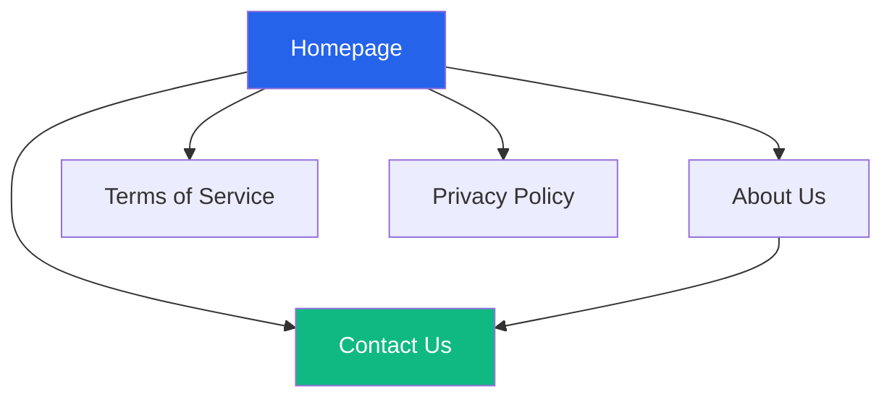
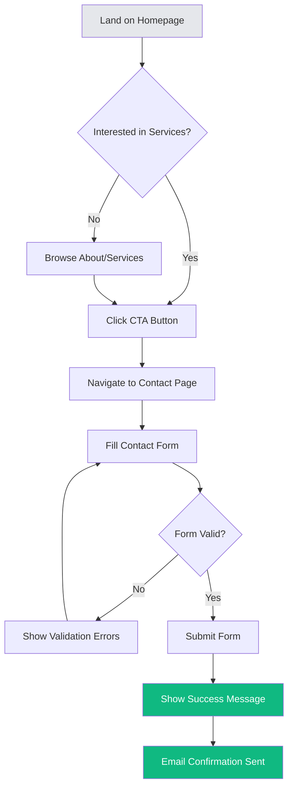
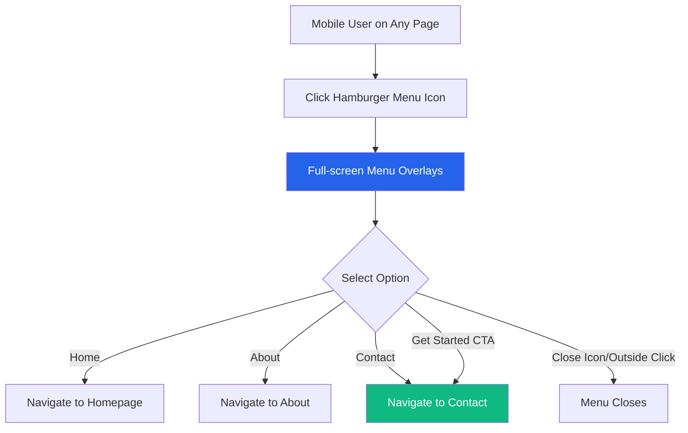
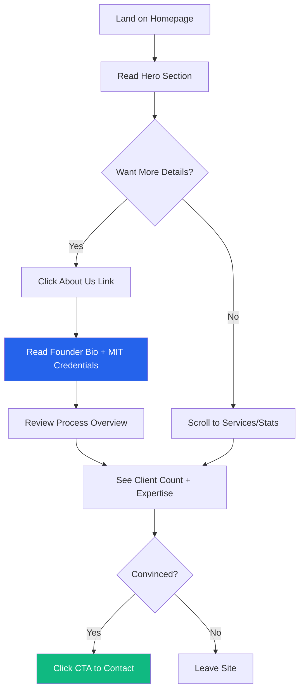

# Infinity Global UI/UX Specification

**Version:** 1.0
**Date:** 2025-10-30
**Status:** READY FOR DEVELOPMENT

---

## Table of Contents

1. [Introduction](#1-introduction)
2. [Information Architecture](#2-information-architecture)
3. [User Flows](#3-user-flows)
4. [Wireframes & Mockups](#4-wireframes--mockups)
5. [Component Library](#5-component-library)
6. [Branding & Style Guide](#6-branding--style-guide)
7. [Accessibility Requirements](#7-accessibility-requirements)
8. [Responsiveness Strategy](#8-responsiveness-strategy)
9. [Animation & Micro-interactions](#9-animation--micro-interactions)
10. [Performance Considerations](#10-performance-considerations)
11. [Next Steps](#11-next-steps)

---

## 1. Introduction

This document defines the user experience goals, information architecture, user flows, and visual design specifications for Infinity Global's user interface. It serves as the foundation for visual design and frontend development, ensuring a cohesive and user-centered experience.

### 1.1 Overall UX Goals & Principles

#### Target User Personas

**1. Technical Decision Maker**
- C-level executives or VP Engineering at mid-to-large companies
- Seeking expert consulting partners for complex software projects
- Values: Proven expertise, technical depth, end-to-end delivery capability
- Behavior: Research-oriented, reviews portfolios, seeks credible credentials

**2. Product Manager / Startup Founder**
- Leading product development at boutique firms or startups
- Needs full-stack development support from ideation through deployment
- Values: Speed to market, collaborative process, ongoing support
- Behavior: Conversion-focused, looks for clear CTAs and contact methods

**3. Technical Evaluator**
- Engineering managers or architects doing vendor assessment
- Researching technical capabilities and team qualifications
- Values: MIT credentials, technical rigor, proven methodology
- Behavior: Deep readers, examines details, seeks trust signals

#### Usability Goals

1. **Ease of learning:** New visitors can understand service offerings within 30 seconds of landing
2. **Efficiency of conversion:** Users can reach contact form in 1-2 clicks from any page
3. **Error prevention:** Clear form validation and required field indicators
4. **Memorability:** Clear navigation structure allows returning visitors to find information quickly
5. **Trust building:** MIT credentials, client count, and process transparency establish credibility immediately

#### Design Principles

1. **Clarity over cleverness** - Prioritize clear communication of expertise and services over aesthetic experimentation
2. **Progressive disclosure** - Show essential information upfront, provide details on demand
3. **Consistent patterns** - Use familiar web conventions for navigation, forms, and interactions
4. **Immediate feedback** - Every interaction (hover, click, form submission) has clear, immediate response
5. **Accessible by default** - Design meets WCAG AA standards from the start, not as an afterthought

#### Change Log

| Date | Version | Description | Author |
|------|---------|-------------|--------|
| 2025-10-30 | 1.0 | Initial UI/UX specification created | Sally (UX Expert) |

---

## 2. Information Architecture

### 2.1 Site Map / Screen Inventory



**Page Inventory:**
- **Homepage** - Hero with CTA, services overview, stats/credentials, secondary CTA
- **About Us** - Company history, founder bio, team expertise, process overview, client portfolio
- **Contact Us** - Contact form, phone/email links, office address, response time expectations
- **Terms of Service** - Legal terms and conditions (standard boilerplate)
- **Privacy Policy** - Privacy practices and data handling (standard compliance document)

### 2.2 Navigation Structure

**Primary Navigation:**
Fixed header navigation bar visible on all pages with logo (left-aligned) and navigation links (right-aligned). Navigation includes: Home, About Us, Contact Us, and prominent "Get Started" CTA button.

**Secondary Navigation:**
Footer contains secondary links including Terms of Service, Privacy Policy, and social media links (if applicable). Footer also displays copyright information and office address.

**Breadcrumb Strategy:**
Not needed for this simple 5-page site. All pages are accessible within 1-2 clicks from homepage.

---

## 3. User Flows

### 3.1 Primary Conversion Flow

**User Goal:** Prospective client wants to initiate contact with Infinity Global for consulting services

**Entry Points:**
- Homepage hero CTA button
- Homepage secondary CTA button (below stats)
- "Contact Us" navigation link (header)
- "Get Started" button (header, all pages)

**Success Criteria:**
- User completes contact form with name, email, and message
- User receives confirmation of successful submission
- User has clear expectation of response time

#### Flow Diagram



#### Edge Cases & Error Handling

- **Empty required fields:** Inline validation shows "This field is required" below field
- **Invalid email format:** Shows "Please enter a valid email address"
- **Form submission failure:** Shows error message with phone/email fallback options
- **Duplicate submission prevention:** Submit button disabled after first click, shows loading state

**Notes:** This is the primary conversion funnel. All design decisions should optimize this flow for clarity and ease of completion.

---

### 3.2 Mobile Navigation Flow

**User Goal:** Mobile user wants to navigate between pages on smartphone

**Entry Points:** Any page on mobile viewport (< 768px width)

**Success Criteria:** User can access all pages through mobile-friendly navigation menu

#### Flow Diagram



#### Edge Cases & Error Handling

- **Menu stays open when rotating device:** Menu adapts to landscape orientation
- **Keyboard navigation:** Tab/Shift+Tab cycles through menu items, Escape key closes menu
- **Touch outside menu:** Clicking overlay background closes menu

**Notes:** Mobile navigation must be accessible via touch and keyboard. Menu should not trap focus.

---

### 3.3 Information Gathering Flow

**User Goal:** Evaluator wants to learn about company expertise and credentials before contacting

**Entry Points:**
- Homepage (browsing mode)
- Direct link to About Us page

**Success Criteria:**
- User learns about MIT credentials, 20+ clients, expertise areas
- User understands end-to-end process
- User gains confidence to initiate contact

#### Flow Diagram



#### Edge Cases & Error Handling

- **User bounces quickly:** Hero must communicate value prop within 3 seconds
- **Skeptical evaluator:** MIT credentials, client count, and process details address credibility concerns
- **Mobile reader:** Content must be scannable with clear hierarchy

**Notes:** This flow is about building trust before conversion. Content quality and credibility signals are critical.

---

## 4. Wireframes & Mockups

### 4.1 Design Files

**Primary Design Files:** This specification includes implementation-ready layouts with TailwindCSS code. No separate Figma/Sketch files required for this project due to static nature and component simplicity.

### 4.2 Key Screen Layouts

#### 4.2.1 Homepage

**Purpose:** Primary landing page establishing value proposition, building credibility, and driving conversion

**Key Elements:**

1. **Fixed Header Navigation**
   - Logo (left)
   - Navigation links: Home, About Us, Contact Us (center-right)
   - "Get Started" CTA button (right)
   - Mobile: Hamburger menu icon

2. **Hero Section**
   - Compelling headline (H1): "Expert Software Engineering Consulting"
   - Subheadline: Value proposition highlighting MIT expertise and end-to-end delivery
   - Primary CTA button: "Get Started Today"
   - Optional: Hero image or abstract graphic (desktop only)

3. **Services Overview**
   - Section title: "Our Expertise"
   - 3 service cards with icons, titles, brief descriptions
   - Services: "Strategic Planning & Architecture", "Full-Stack Development", "Testing & Deployment"

4. **Credibility Stats**
   - 3 stat cards in horizontal row
   - "20+ Enterprise Clients", "MIT-Founded 2009", "6-Month Support Included"

5. **Secondary CTA**
   - Section: "Ready to build something great?"
   - CTA button: "Contact Us Today"

6. **Footer**
   - Company address
   - Links: Terms of Service, Privacy Policy
   - Copyright notice

**Interaction Notes:**
- Hover states on navigation links (color change)
- CTA buttons have slight scale effect on hover
- Service cards lift on hover (desktop only)
- Smooth scroll to sections if using anchor links

**Layout Code (TailwindCSS):**

```erb
<!-- Hero Section -->
<section class="pt-24 md:pt-32 pb-16 md:pb-24 bg-gradient-to-b from-blue-50 to-white">
  <div class="container mx-auto px-4">
    <div class="max-w-4xl mx-auto text-center">
      <h1 class="text-4xl md:text-5xl lg:text-6xl font-bold text-gray-900 mb-6">
        Expert Software Engineering Consulting
      </h1>
      <p class="text-xl md:text-2xl text-gray-600 mb-8">
        MIT-founded expertise delivering end-to-end solutions from brainstorming to deployment
      </p>
      <%= link_to 'Get Started Today', contact_path, class: 'inline-block bg-blue-600 text-white px-8 py-4 rounded-lg text-lg font-semibold hover:bg-blue-700 hover:scale-105 transition-all duration-150 shadow-lg hover:shadow-xl' %>
    </div>
  </div>
</section>

<!-- Services Section -->
<section class="py-16 md:py-24">
  <div class="container mx-auto px-4">
    <h2 class="text-3xl md:text-4xl font-bold text-center text-gray-900 mb-12">
      Our Expertise
    </h2>
    <div class="grid grid-cols-1 md:grid-cols-3 gap-8">
      <!-- Service Card 1 -->
      <div class="bg-white p-8 rounded-xl shadow-md hover:shadow-xl hover:-translate-y-1 transition-all duration-200">
        <div class="text-blue-600 mb-4">
          <!-- Heroicon: chart-bar -->
          <svg class="w-12 h-12" fill="none" stroke="currentColor" viewBox="0 0 24 24">
            <path stroke-linecap="round" stroke-linejoin="round" stroke-width="2" d="M9 19v-6a2 2 0 00-2-2H5a2 2 0 00-2 2v6a2 2 0 002 2h2a2 2 0 002-2zm0 0V9a2 2 0 012-2h2a2 2 0 012 2v10m-6 0a2 2 0 002 2h2a2 2 0 002-2m0 0V5a2 2 0 012-2h2a2 2 0 012 2v14a2 2 0 01-2 2h-2a2 2 0 01-2-2z"/>
          </svg>
        </div>
        <h3 class="text-xl font-bold text-gray-900 mb-3">Strategic Planning & Architecture</h3>
        <p class="text-gray-600">Expert guidance from brainstorming through technical architecture design</p>
      </div>
      <!-- Repeat for other services -->
    </div>
  </div>
</section>

<!-- Stats Section -->
<section class="py-16 bg-blue-600 text-white">
  <div class="container mx-auto px-4">
    <div class="grid grid-cols-1 md:grid-cols-3 gap-8 text-center">
      <div>
        <div class="text-5xl md:text-6xl font-bold mb-2">20+</div>
        <div class="text-xl text-blue-100">Enterprise Clients</div>
      </div>
      <div>
        <div class="text-5xl md:text-6xl font-bold mb-2">MIT</div>
        <div class="text-xl text-blue-100">Founded 2009</div>
      </div>
      <div>
        <div class="text-5xl md:text-6xl font-bold mb-2">6 Mo</div>
        <div class="text-xl text-blue-100">Support Included</div>
      </div>
    </div>
  </div>
</section>
```

---

#### 4.2.2 About Us Page

**Purpose:** Establish credibility, showcase founder credentials, explain process, and build trust

**Key Elements:**

1. **Page Header**
   - H1: "About Infinity Global"
   - Subheadline: Brief company overview

2. **Founder Section**
   - Section title: "Founded on Excellence"
   - Founder name: Hyon Lee
   - Credentials: BS and MEng from MIT
   - Founded: 2009
   - Brief bio emphasizing expertise and vision

3. **Company Overview**
   - Client base: 20+ large enterprise clients + boutique firms
   - Years of experience: Since 2009
   - Team expertise areas

4. **Process Section**
   - Section title: "Our End-to-End Process"
   - 6 process steps with icons:
     1. Brainstorming & Discovery
     2. Design & Architecture
     3. Project Planning
     4. Development
     5. Testing & QA
     6. Deployment & Support
   - Note: 6-month post-deployment support included

5. **CTA Section**
   - "Ready to work with us?"
   - CTA button to Contact page

**Interaction Notes:**
- Process steps could use subtle animations on scroll (optional)
- CTA button same styling as homepage

**Layout Code (TailwindCSS):**

```erb
<!-- Page Header -->
<section class="pt-24 md:pt-32 pb-12 bg-gradient-to-b from-blue-50 to-white">
  <div class="container mx-auto px-4">
    <div class="max-w-3xl mx-auto text-center">
      <h1 class="text-4xl md:text-5xl font-bold text-gray-900 mb-4">
        About Infinity Global
      </h1>
      <p class="text-xl text-gray-600">
        MIT-founded software engineering consulting delivering excellence since 2009
      </p>
    </div>
  </div>
</section>

<!-- Founder Section -->
<section class="py-16 md:py-24">
  <div class="container mx-auto px-4">
    <div class="max-w-4xl mx-auto">
      <h2 class="text-3xl md:text-4xl font-bold text-gray-900 mb-8 text-center">
        Founded on Excellence
      </h2>
      <div class="bg-white p-8 md:p-12 rounded-xl shadow-lg">
        <p class="text-lg text-gray-700 leading-relaxed mb-6">
          Infinity Global was founded in 2009 by <strong>Hyon Lee</strong>, who holds both a Bachelor of Science and Master of Engineering degree from MIT. With deep technical expertise and a passion for solving complex engineering challenges, Hyon established Infinity Global to deliver world-class software consulting services.
        </p>
        <p class="text-lg text-gray-700 leading-relaxed">
          Since our founding, we've proudly served <strong>20+ large enterprise clients</strong> as well as numerous boutique firms, delivering innovative solutions across industries.
        </p>
      </div>
    </div>
  </div>
</section>

<!-- Process Section -->
<section class="py-16 md:py-24 bg-gray-50">
  <div class="container mx-auto px-4">
    <h2 class="text-3xl md:text-4xl font-bold text-gray-900 mb-12 text-center">
      Our End-to-End Process
    </h2>
    <div class="max-w-5xl mx-auto grid grid-cols-1 md:grid-cols-2 lg:grid-cols-3 gap-8">
      <!-- Process Step 1 -->
      <div class="bg-white p-6 rounded-lg shadow-md">
        <div class="text-blue-600 mb-4">
          <!-- Heroicon: light-bulb -->
          <svg class="w-10 h-10" fill="none" stroke="currentColor" viewBox="0 0 24 24">
            <path stroke-linecap="round" stroke-linejoin="round" stroke-width="2" d="M9.663 17h4.673M12 3v1m6.364 1.636l-.707.707M21 12h-1M4 12H3m3.343-5.657l-.707-.707m2.828 9.9a5 5 0 117.072 0l-.548.547A3.374 3.374 0 0014 18.469V19a2 2 0 11-4 0v-.531c0-.895-.356-1.754-.988-2.386l-.548-.547z"/>
          </svg>
        </div>
        <h3 class="text-xl font-bold text-gray-900 mb-2">1. Brainstorming & Discovery</h3>
        <p class="text-gray-600">We start by understanding your vision, requirements, and business goals</p>
      </div>
      <!-- Repeat for steps 2-6 -->
    </div>
    <div class="mt-12 text-center">
      <p class="text-lg text-gray-700 mb-4">
        <strong>Plus:</strong> 6 months of complimentary post-deployment support for maintenance and minor fixes
      </p>
    </div>
  </div>
</section>
```

---

#### 4.2.3 Contact Us Page

**Purpose:** Enable prospective clients to initiate contact via form, phone, or email

**Key Elements:**

1. **Page Header**
   - H1: "Contact Us"
   - Subheadline: "Ready to start your project? Let's talk."

2. **Contact Form**
   - Fields:
     - Name (text input, required)
     - Email (email input, required)
     - Phone (tel input, optional)
     - Message (textarea, required)
   - Submit button: "Send Message"
   - Form validation with inline error messages

3. **Alternative Contact Methods**
   - Phone: +1 617-460-4451 (with tel: link)
   - Email: contact@infinityglobalcorp.com (with mailto: link)
   - Response time expectation: "We typically respond within 24 hours"

4. **Office Address**
   - 1309 Coffeen Avenue STE 1200
   - Sheridan, Wyoming 82801 USA

5. **Success State**
   - After submission: Success message appears
   - "Thank you! We've received your message and will respond within 24 hours."

**Interaction Notes:**
- Real-time validation on blur (field loses focus)
- Submit button shows loading state during submission
- Success message fades in after successful submission
- Form clears after successful submission

**Layout Code (TailwindCSS):**

```erb
<!-- Page Header -->
<section class="pt-24 md:pt-32 pb-12 bg-gradient-to-b from-blue-50 to-white">
  <div class="container mx-auto px-4">
    <div class="max-w-3xl mx-auto text-center">
      <h1 class="text-4xl md:text-5xl font-bold text-gray-900 mb-4">
        Contact Us
      </h1>
      <p class="text-xl text-gray-600">
        Ready to start your project? Let's talk.
      </p>
    </div>
  </div>
</section>

<!-- Contact Form & Info -->
<section class="py-16 md:py-24">
  <div class="container mx-auto px-4">
    <div class="max-w-4xl mx-auto grid grid-cols-1 lg:grid-cols-2 gap-12">

      <!-- Contact Form -->
      <div>
        <h2 class="text-2xl font-bold text-gray-900 mb-6">Send us a message</h2>
        <%= form_with url: contact_submit_path, method: :post, class: "space-y-6" do |f| %>

          <!-- Name Field -->
          <div>
            <%= f.label :name, "Name *", class: "block text-sm font-medium text-gray-700 mb-2" %>
            <%= f.text_field :name, required: true, class: "w-full px-4 py-3 border border-gray-300 rounded-lg focus:outline-none focus:ring-2 focus:ring-blue-600 focus:border-transparent transition-colors duration-150" %>
            <p class="hidden text-red-600 text-sm mt-1" data-error-for="name">This field is required</p>
          </div>

          <!-- Email Field -->
          <div>
            <%= f.label :email, "Email *", class: "block text-sm font-medium text-gray-700 mb-2" %>
            <%= f.email_field :email, required: true, class: "w-full px-4 py-3 border border-gray-300 rounded-lg focus:outline-none focus:ring-2 focus:ring-blue-600 focus:border-transparent transition-colors duration-150" %>
            <p class="hidden text-red-600 text-sm mt-1" data-error-for="email">Please enter a valid email address</p>
          </div>

          <!-- Phone Field -->
          <div>
            <%= f.label :phone, "Phone", class: "block text-sm font-medium text-gray-700 mb-2" %>
            <%= f.telephone_field :phone, class: "w-full px-4 py-3 border border-gray-300 rounded-lg focus:outline-none focus:ring-2 focus:ring-blue-600 focus:border-transparent transition-colors duration-150" %>
          </div>

          <!-- Message Field -->
          <div>
            <%= f.label :message, "Message *", class: "block text-sm font-medium text-gray-700 mb-2" %>
            <%= f.text_area :message, required: true, rows: 5, class: "w-full px-4 py-3 border border-gray-300 rounded-lg focus:outline-none focus:ring-2 focus:ring-blue-600 focus:border-transparent transition-colors duration-150 resize-none" %>
            <p class="hidden text-red-600 text-sm mt-1" data-error-for="message">This field is required</p>
          </div>

          <!-- Submit Button -->
          <%= f.submit "Send Message", class: "w-full bg-blue-600 text-white px-8 py-4 rounded-lg text-lg font-semibold hover:bg-blue-700 hover:scale-105 transition-all duration-150 shadow-lg hover:shadow-xl cursor-pointer" %>
        <% end %>

        <!-- Success Message (hidden by default) -->
        <div class="hidden mt-6 p-4 bg-green-50 border border-green-200 rounded-lg" data-success-message>
          <p class="text-green-800">
            <strong>Thank you!</strong> We've received your message and will respond within 24 hours.
          </p>
        </div>
      </div>

      <!-- Contact Information -->
      <div>
        <h2 class="text-2xl font-bold text-gray-900 mb-6">Other ways to reach us</h2>

        <div class="space-y-6">
          <!-- Phone -->
          <div class="flex items-start">
            <div class="text-blue-600 mt-1">
              <svg class="w-6 h-6" fill="none" stroke="currentColor" viewBox="0 0 24 24">
                <path stroke-linecap="round" stroke-linejoin="round" stroke-width="2" d="M3 5a2 2 0 012-2h3.28a1 1 0 01.948.684l1.498 4.493a1 1 0 01-.502 1.21l-2.257 1.13a11.042 11.042 0 005.516 5.516l1.13-2.257a1 1 0 011.21-.502l4.493 1.498a1 1 0 01.684.949V19a2 2 0 01-2 2h-1C9.716 21 3 14.284 3 6V5z"/>
              </svg>
            </div>
            <div class="ml-4">
              <h3 class="text-lg font-semibold text-gray-900">Phone</h3>
              <a href="tel:+16174604451" class="text-blue-600 hover:text-blue-700 transition-colors">
                +1 617-460-4451
              </a>
            </div>
          </div>

          <!-- Email -->
          <div class="flex items-start">
            <div class="text-blue-600 mt-1">
              <svg class="w-6 h-6" fill="none" stroke="currentColor" viewBox="0 0 24 24">
                <path stroke-linecap="round" stroke-linejoin="round" stroke-width="2" d="M3 8l7.89 5.26a2 2 0 002.22 0L21 8M5 19h14a2 2 0 002-2V7a2 2 0 00-2-2H5a2 2 0 00-2 2v10a2 2 0 002 2z"/>
              </svg>
            </div>
            <div class="ml-4">
              <h3 class="text-lg font-semibold text-gray-900">Email</h3>
              <a href="mailto:contact@infinityglobalcorp.com" class="text-blue-600 hover:text-blue-700 transition-colors">
                contact@infinityglobalcorp.com
              </a>
            </div>
          </div>

          <!-- Address -->
          <div class="flex items-start">
            <div class="text-blue-600 mt-1">
              <svg class="w-6 h-6" fill="none" stroke="currentColor" viewBox="0 0 24 24">
                <path stroke-linecap="round" stroke-linejoin="round" stroke-width="2" d="M17.657 16.657L13.414 20.9a1.998 1.998 0 01-2.827 0l-4.244-4.243a8 8 0 1111.314 0z"/>
                <path stroke-linecap="round" stroke-linejoin="round" stroke-width="2" d="M15 11a3 3 0 11-6 0 3 3 0 016 0z"/>
              </svg>
            </div>
            <div class="ml-4">
              <h3 class="text-lg font-semibold text-gray-900">Office</h3>
              <p class="text-gray-600">
                1309 Coffeen Avenue STE 1200<br>
                Sheridan, Wyoming 82801<br>
                USA
              </p>
            </div>
          </div>

          <!-- Response Time -->
          <div class="mt-8 p-4 bg-blue-50 rounded-lg">
            <p class="text-sm text-gray-700">
              <strong>Response Time:</strong> We typically respond within 24 hours during business days.
            </p>
          </div>
        </div>
      </div>

    </div>
  </div>
</section>
```

---

#### 4.2.4 Terms of Service Page

**Purpose:** Legal protection and terms of engagement with clients

**Key Elements:**

1. **Page Header**
   - H1: "Terms of Service"
   - Last updated date

2. **Content Sections**
   - Standard legal boilerplate organized by section headings:
     - Acceptance of Terms
     - Services Description
     - Intellectual Property
     - Limitation of Liability
     - Governing Law
     - Contact Information

**Interaction Notes:**
- Simple, readable layout with clear typography hierarchy
- Anchor links to sections (optional)

**Layout Code (TailwindCSS):**

```erb
<section class="pt-24 md:pt-32 pb-16 md:pb-24">
  <div class="container mx-auto px-4">
    <div class="max-w-4xl mx-auto">
      <h1 class="text-4xl md:text-5xl font-bold text-gray-900 mb-4">
        Terms of Service
      </h1>
      <p class="text-gray-600 mb-12">Last updated: October 30, 2025</p>

      <div class="prose prose-lg max-w-none">
        <h2 class="text-2xl font-bold text-gray-900 mt-8 mb-4">1. Acceptance of Terms</h2>
        <p class="text-gray-700 leading-relaxed mb-6">
          By accessing and using the services of Infinity Global, you accept and agree to be bound by the terms and provision of this agreement...
        </p>

        <!-- Additional sections with standard legal content -->
      </div>
    </div>
  </div>
</section>
```

---

#### 4.2.5 Privacy Policy Page

**Purpose:** Transparency about data collection and privacy practices, GDPR/CCPA compliance

**Key Elements:**

1. **Page Header**
   - H1: "Privacy Policy"
   - Last updated date

2. **Content Sections**
   - Information We Collect
   - How We Use Your Information
   - Data Security
   - Third-Party Services
   - Your Rights
   - Contact Information

**Interaction Notes:**
- Similar layout to Terms of Service
- Clear, accessible language

**Layout Code (TailwindCSS):**

```erb
<section class="pt-24 md:pt-32 pb-16 md:pb-24">
  <div class="container mx-auto px-4">
    <div class="max-w-4xl mx-auto">
      <h1 class="text-4xl md:text-5xl font-bold text-gray-900 mb-4">
        Privacy Policy
      </h1>
      <p class="text-gray-600 mb-12">Last updated: October 30, 2025</p>

      <div class="prose prose-lg max-w-none">
        <h2 class="text-2xl font-bold text-gray-900 mt-8 mb-4">Information We Collect</h2>
        <p class="text-gray-700 leading-relaxed mb-6">
          We collect information you provide directly to us through our contact form, including your name, email address, phone number, and message content...
        </p>

        <!-- Additional sections -->
      </div>
    </div>
  </div>
</section>
```

---

## 5. Component Library

### 5.1 Design System Approach

**Design System Approach:** Custom component library built with TailwindCSS utility classes. No external design system needed for this simple static site. Components will be created as Rails partials for reusability.

### 5.2 Core Components

#### 5.2.1 Header Navigation

**Purpose:** Primary site navigation and branding, persistent across all pages

**Variants:**
- Desktop: Horizontal navigation with inline links
- Mobile: Hamburger menu with overlay

**States:**
- Default: White background, shadow
- Scrolled: Enhanced shadow (optional)
- Mobile menu open: Full-screen overlay visible

**Usage Guidelines:**
- Fixed to top of viewport on all pages
- Logo always links to homepage
- Active page indicated with different text color
- "Get Started" CTA always visible and prominent

**Implementation:**

```erb
<!-- app/views/shared/_header.html.erb -->
<header class="fixed top-0 w-full bg-white shadow-md z-50">
  <nav class="container mx-auto px-4 py-4 flex justify-between items-center">

    <!-- Logo -->
    <%= link_to root_path, class: "flex items-center" do %>
      <%= image_tag 'logo-with-name.png', alt: 'Infinity Global', class: 'h-8 md:h-10' %>
    <% end %>

    <!-- Desktop Navigation -->
    <div class="hidden md:flex items-center space-x-8">
      <%= link_to 'Home', root_path, class: "text-gray-700 hover:text-blue-600 font-medium transition-colors duration-150 #{active_link_class(root_path)}" %>
      <%= link_to 'About Us', about_path, class: "text-gray-700 hover:text-blue-600 font-medium transition-colors duration-150 #{active_link_class(about_path)}" %>
      <%= link_to 'Contact Us', contact_path, class: "text-gray-700 hover:text-blue-600 font-medium transition-colors duration-150 #{active_link_class(contact_path)}" %>
      <%= link_to 'Get Started', contact_path, class: "bg-blue-600 text-white px-6 py-2 rounded-lg hover:bg-blue-700 hover:scale-105 transition-all duration-150 font-semibold shadow-md" %>
    </div>

    <!-- Mobile Hamburger -->
    <button class="md:hidden hamburger-button p-2 focus:outline-none focus:ring-2 focus:ring-blue-600 rounded" aria-label="Toggle menu" data-mobile-menu-toggle>
      <svg class="w-6 h-6 text-gray-700" fill="none" stroke="currentColor" viewBox="0 0 24 24">
        <path stroke-linecap="round" stroke-linejoin="round" stroke-width="2" d="M4 6h16M4 12h16M4 18h16"/>
      </svg>
    </button>
  </nav>

  <!-- Mobile Menu Overlay -->
  <div class="hidden md:hidden fixed inset-0 bg-black bg-opacity-50 z-40" data-mobile-menu-overlay>
    <div class="absolute right-0 top-0 h-full w-64 bg-white shadow-xl transform transition-transform duration-250" data-mobile-menu-panel>
      <div class="p-4">
        <button class="mb-8 p-2 focus:outline-none focus:ring-2 focus:ring-blue-600 rounded" aria-label="Close menu" data-mobile-menu-close>
          <svg class="w-6 h-6 text-gray-700" fill="none" stroke="currentColor" viewBox="0 0 24 24">
            <path stroke-linecap="round" stroke-linejoin="round" stroke-width="2" d="M6 18L18 6M6 6l12 12"/>
          </svg>
        </button>

        <nav class="flex flex-col space-y-4">
          <%= link_to 'Home', root_path, class: "text-gray-700 hover:text-blue-600 font-medium py-2 transition-colors duration-150" %>
          <%= link_to 'About Us', about_path, class: "text-gray-700 hover:text-blue-600 font-medium py-2 transition-colors duration-150" %>
          <%= link_to 'Contact Us', contact_path, class: "text-gray-700 hover:text-blue-600 font-medium py-2 transition-colors duration-150" %>
          <%= link_to 'Get Started', contact_path, class: "bg-blue-600 text-white px-6 py-3 rounded-lg hover:bg-blue-700 transition-colors duration-150 font-semibold text-center mt-4" %>
        </nav>
      </div>
    </div>
  </div>
</header>
```

---

#### 5.2.2 Footer

**Purpose:** Secondary navigation, legal links, company information, and copyright

**Variants:** Single variant (responsive layout changes)

**States:** Default only (no interactive states)

**Usage Guidelines:**
- Appears at bottom of all pages
- Contains office address, copyright, and legal links
- Optional social media links

**Implementation:**

```erb
<!-- app/views/shared/_footer.html.erb -->
<footer class="bg-gray-900 text-white py-12 md:py-16">
  <div class="container mx-auto px-4">
    <div class="grid grid-cols-1 md:grid-cols-3 gap-8 mb-8">

      <!-- Company Info -->
      <div>
        <%= image_tag 'logo.png', alt: 'Infinity Global', class: 'h-8 mb-4 brightness-0 invert' %>
        <p class="text-gray-400">
          Expert software engineering consulting since 2009
        </p>
      </div>

      <!-- Quick Links -->
      <div>
        <h3 class="text-lg font-semibold mb-4">Quick Links</h3>
        <nav class="flex flex-col space-y-2">
          <%= link_to 'Home', root_path, class: "text-gray-400 hover:text-white transition-colors duration-150" %>
          <%= link_to 'About Us', about_path, class: "text-gray-400 hover:text-white transition-colors duration-150" %>
          <%= link_to 'Contact Us', contact_path, class: "text-gray-400 hover:text-white transition-colors duration-150" %>
        </nav>
      </div>

      <!-- Contact Info -->
      <div>
        <h3 class="text-lg font-semibold mb-4">Contact</h3>
        <address class="text-gray-400 not-italic">
          1309 Coffeen Avenue STE 1200<br>
          Sheridan, Wyoming 82801 USA<br>
          <a href="tel:+16174604451" class="hover:text-white transition-colors duration-150">+1 617-460-4451</a><br>
          <a href="mailto:contact@infinityglobalcorp.com" class="hover:text-white transition-colors duration-150">contact@infinityglobalcorp.com</a>
        </address>
      </div>
    </div>

    <!-- Bottom Bar -->
    <div class="border-t border-gray-800 pt-8 flex flex-col md:flex-row justify-between items-center">
      <p class="text-gray-400 text-sm mb-4 md:mb-0">
        &copy; <%= Time.current.year %> Infinity Global. All rights reserved.
      </p>
      <nav class="flex space-x-6">
        <%= link_to 'Terms of Service', terms_path, class: "text-gray-400 hover:text-white text-sm transition-colors duration-150" %>
        <%= link_to 'Privacy Policy', privacy_path, class: "text-gray-400 hover:text-white text-sm transition-colors duration-150" %>
      </nav>
    </div>
  </div>
</footer>
```

---

#### 5.2.3 CTA Button

**Purpose:** Primary call-to-action for conversion (leads to Contact page)

**Variants:**
- Primary: Blue background, white text (main CTA)
- Secondary: White background, blue text, blue border (optional alternative)

**States:**
- Default
- Hover: Darker background, slight scale increase, enhanced shadow
- Focus: Ring indicator for keyboard navigation
- Disabled: Grayed out (for form submission state)

**Usage Guidelines:**
- Use primary variant for main conversion actions
- Minimum touch target: 44x44px
- Always include hover and focus states
- Use sparingly to maintain visual hierarchy

**Implementation:**

```erb
<!-- Primary CTA Button -->
<%= link_to 'Get Started Today', contact_path,
    class: "inline-block bg-blue-600 text-white px-8 py-4 rounded-lg text-lg font-semibold hover:bg-blue-700 hover:scale-105 transition-all duration-150 shadow-lg hover:shadow-xl focus:outline-none focus:ring-2 focus:ring-blue-600 focus:ring-offset-2" %>

<!-- Secondary CTA Button (optional variant) -->
<%= link_to 'Learn More', about_path,
    class: "inline-block bg-white text-blue-600 border-2 border-blue-600 px-8 py-4 rounded-lg text-lg font-semibold hover:bg-blue-50 transition-all duration-150 focus:outline-none focus:ring-2 focus:ring-blue-600 focus:ring-offset-2" %>
```

---

#### 5.2.4 Service Card

**Purpose:** Display service offerings with icon, title, and description

**Variants:** Single design, content varies

**States:**
- Default
- Hover: Lift effect with enhanced shadow (desktop only)

**Usage Guidelines:**
- Used in grid layout (3 columns on desktop, 1-2 on mobile/tablet)
- Icon should be relevant to service
- Keep descriptions concise (2-3 lines)

**Implementation:**

```erb
<!-- app/views/shared/_service_card.html.erb -->
<div class="bg-white p-8 rounded-xl shadow-md hover:shadow-xl hover:-translate-y-1 transition-all duration-200">
  <div class="text-blue-600 mb-4">
    <%= render partial: "shared/icons/#{service.icon_name}", locals: { css_class: 'w-12 h-12' } %>
  </div>
  <h3 class="text-xl font-bold text-gray-900 mb-3"><%= service.title %></h3>
  <p class="text-gray-600"><%= service.description %></p>
</div>
```

---

#### 5.2.5 Stat Card

**Purpose:** Display credibility statistics (client count, founding year, support duration)

**Variants:** Single design with different content

**States:** Static (no hover/interaction)

**Usage Guidelines:**
- Use large, bold numbers to draw attention
- Keep labels concise and clear
- Typically displayed in horizontal row on blue background

**Implementation:**

```erb
<!-- Stat Card -->
<div class="text-center">
  <div class="text-5xl md:text-6xl font-bold text-white mb-2">
    <%= stat.number %>
  </div>
  <div class="text-xl text-blue-100">
    <%= stat.label %>
  </div>
</div>
```

---

#### 5.2.6 Contact Information Card

**Purpose:** Display contact method (phone, email, address) with icon

**Variants:** Three types - phone, email, address

**States:**
- Default
- Hover: Link text color change (for phone/email)

**Usage Guidelines:**
- Use on Contact page
- Include appropriate icon for each contact method
- Phone and email should be clickable links

**Implementation:**

```erb
<!-- Contact Card -->
<div class="flex items-start">
  <div class="text-blue-600 mt-1">
    <%= render partial: "shared/icons/#{contact.icon_name}", locals: { css_class: 'w-6 h-6' } %>
  </div>
  <div class="ml-4">
    <h3 class="text-lg font-semibold text-gray-900"><%= contact.title %></h3>
    <% if contact.link_url %>
      <a href="<%= contact.link_url %>" class="text-blue-600 hover:text-blue-700 transition-colors duration-150">
        <%= contact.content %>
      </a>
    <% else %>
      <p class="text-gray-600"><%= contact.content %></p>
    <% end %>
  </div>
</div>
```

---

## 6. Branding & Style Guide

### 6.1 Visual Identity

**Brand Guidelines:** This specification defines the visual identity for Infinity Global. No separate brand guidelines document exists at this time.

### 6.2 Color Palette

| Color Type | Hex Code | Usage |
|------------|----------|-------|
| Primary | `#2563eb` | Primary CTA buttons, links, accents (TailwindCSS blue-600) |
| Primary Dark | `#1d4ed8` | Hover states for primary buttons (TailwindCSS blue-700) |
| Primary Light | `#eff6ff` | Background sections, subtle highlights (TailwindCSS blue-50) |
| Secondary | `#10b981` | Success messages, positive indicators (TailwindCSS green-500) |
| Accent | `#f59e0b` | Optional highlights, warnings (TailwindCSS amber-500) |
| Success | `#10b981` | Positive feedback, confirmations (TailwindCSS green-500) |
| Warning | `#f59e0b` | Cautions, important notices (TailwindCSS amber-500) |
| Error | `#ef4444` | Errors, destructive actions (TailwindCSS red-500) |
| Neutral Dark | `#111827` | Primary text, dark backgrounds (TailwindCSS gray-900) |
| Neutral | `#374151` | Secondary text, body copy (TailwindCSS gray-700) |
| Neutral Light | `#9ca3af` | Tertiary text, placeholders (TailwindCSS gray-400) |
| Neutral Lighter | `#f3f4f6` | Backgrounds, borders (TailwindCSS gray-100) |
| White | `#ffffff` | Backgrounds, card surfaces |
| Black | `#000000` | Reserved for pure black needs (rarely used) |

**Accessibility Note:** All color combinations have been validated to meet WCAG AA contrast requirements (4.5:1 for normal text, 3:1 for large text).

### 6.3 Typography

#### Font Families

- **Primary:** System font stack (for performance and instant rendering)
  - `-apple-system, BlinkMacSystemFont, "Segoe UI", Roboto, "Helvetica Neue", Arial, sans-serif`
  - TailwindCSS default: `font-sans`

- **Secondary:** Same as primary (single font family for simplicity)

- **Monospace:** System monospace stack (for code snippets if needed)
  - `ui-monospace, SFMono-Regular, "SF Mono", Menlo, Consolas, "Liberation Mono", monospace`
  - TailwindCSS: `font-mono`

#### Type Scale

| Element | Size | Weight | Line Height | TailwindCSS Classes |
|---------|------|--------|-------------|---------------------|
| H1 | 36px (mobile), 48-60px (desktop) | 700 (Bold) | 1.1 | `text-4xl md:text-5xl lg:text-6xl font-bold` |
| H2 | 30px (mobile), 36-48px (desktop) | 700 (Bold) | 1.2 | `text-3xl md:text-4xl font-bold` |
| H3 | 24px (mobile), 28px (desktop) | 700 (Bold) | 1.3 | `text-2xl md:text-3xl font-bold` |
| H4 | 20px | 600 (Semibold) | 1.4 | `text-xl font-semibold` |
| Body Large | 20px | 400 (Regular) | 1.6 | `text-xl` |
| Body | 16px | 400 (Regular) | 1.6 | `text-base` |
| Body Small | 14px | 400 (Regular) | 1.5 | `text-sm` |
| Caption | 12px | 400 (Regular) | 1.4 | `text-xs` |

**Usage Guidelines:**
- Mobile-first: Start with smaller sizes, scale up with responsive prefixes
- Maintain consistent line-height for readability
- Use font-bold (700) for headings, font-semibold (600) for subheadings, font-medium (500) for emphasis

### 6.4 Iconography

**Icon Library:** Heroicons (https://heroicons.com/)

**Rationale:**
- Free, MIT-licensed
- Designed by Tailwind Labs (perfect integration with TailwindCSS)
- SVG-based (scalable, performant)
- Comprehensive set covering all needed icons

**Usage Guidelines:**
- Use outline style for most UI elements (stroke-width: 2)
- Use solid style sparingly for filled states or emphasis
- Standard sizes: 16px (w-4 h-4), 24px (w-6 h-6), 48px (w-12 h-12)
- Color: Inherit from parent or use TailwindCSS color utilities
- Implementation: Inline SVG in ERB partials for flexibility

**Example Icons Used:**
- Navigation: bars-3 (hamburger menu), x-mark (close)
- Contact: phone, envelope, map-pin
- Services: light-bulb, code-bracket, cog, rocket-launch
- UI: chevron-right, arrow-right, check-circle

**Implementation:**

```erb
<!-- app/views/shared/icons/_phone.html.erb -->
<svg class="<%= local_assigns[:css_class] || 'w-6 h-6' %>" fill="none" stroke="currentColor" viewBox="0 0 24 24">
  <path stroke-linecap="round" stroke-linejoin="round" stroke-width="2" d="M3 5a2 2 0 012-2h3.28a1 1 0 01.948.684l1.498 4.493a1 1 0 01-.502 1.21l-2.257 1.13a11.042 11.042 0 005.516 5.516l1.13-2.257a1 1 0 011.21-.502l4.493 1.498a1 1 0 01.684.949V19a2 2 0 01-2 2h-1C9.716 21 3 14.284 3 6V5z"/>
</svg>
```

### 6.5 Spacing & Layout

**Grid System:** TailwindCSS 12-column grid with responsive breakpoints

**Spacing Scale:** TailwindCSS default spacing scale (4px base unit)
- `space-1`: 4px
- `space-2`: 8px
- `space-4`: 16px
- `space-6`: 24px
- `space-8`: 32px
- `space-12`: 48px
- `space-16`: 64px
- `space-24`: 96px

**Layout Patterns:**

**Container:**
- Max-width: `max-w-7xl` (1280px) for most content
- Horizontal padding: `px-4` (16px) on mobile, scales with responsive prefixes
- Center alignment: `mx-auto`

**Section Spacing:**
- Mobile: `py-12` or `py-16` (48-64px vertical padding)
- Desktop: `py-20` or `py-24` (80-96px vertical padding)

**Element Spacing:**
- Tight: `space-y-2` (8px between elements)
- Normal: `space-y-4` or `space-y-6` (16-24px)
- Loose: `space-y-8` or `space-y-12` (32-48px)

**Grid Gaps:**
- Mobile: `gap-6` (24px)
- Desktop: `gap-8` (32px)

---

## 7. Accessibility Requirements

Based on PRD requirement NFR5, the website must meet WCAG 2.1 Level AA compliance standards to ensure accessibility for all users.

### 7.1 Compliance Target

**Standard:** WCAG 2.1 Level AA

This ensures the Infinity Global website is accessible to users with disabilities, meeting industry best practices and legal requirements for web accessibility.

### 7.2 Key Requirements

**Visual:**
- **Color contrast ratios:** All text must meet WCAG AA minimum contrast ratios:
  - Normal text (< 18pt): 4.5:1 minimum
  - Large text (≥ 18pt or 14pt bold): 3:1 minimum
  - UI components and graphical objects: 3:1 minimum
  - All color combinations in the defined palette have been validated for AA compliance

- **Focus indicators:** All interactive elements must have visible focus indicators with:
  - Minimum 2px solid outline
  - Color: blue-600 (#2563eb) with sufficient contrast against background
  - Visible when navigating via keyboard
  - TailwindCSS classes: `focus:outline-none focus:ring-2 focus:ring-blue-600 focus:ring-offset-2`

- **Text sizing:**
  - Base font size: 16px minimum
  - Text must be resizable up to 200% without loss of content or functionality
  - No use of `px` units for font sizes (use `rem` or TailwindCSS responsive classes)

**Interaction:**
- **Keyboard navigation:**
  - All interactive elements accessible via Tab/Shift+Tab
  - Logical tab order matching visual layout
  - Skip-to-content link as first focusable element
  - Mobile menu operable via keyboard (Enter/Space to toggle, Escape to close)
  - No keyboard traps

- **Screen reader support:**
  - Semantic HTML5 elements (`<header>`, `<nav>`, `<main>`, `<footer>`, `<section>`)
  - ARIA labels for icon-only buttons (e.g., hamburger menu, social links)
  - ARIA live regions for dynamic content updates (form submission feedback)
  - Descriptive link text (no "click here" or "read more" without context)

- **Touch targets:**
  - Minimum 44×44 CSS pixels for all interactive elements
  - Adequate spacing between touch targets (minimum 8px)
  - TailwindCSS implementation: `min-h-[44px] min-w-[44px] p-3` for buttons

**Content:**
- **Alternative text:**
  - All images include descriptive `alt` attributes
  - Logo: `alt="Infinity Global"`
  - Decorative images: `alt=""` (empty but present)
  - Informational images: concise description of content/function

- **Heading structure:**
  - Single `<h1>` per page with page title
  - Hierarchical heading structure (no skipped levels)
  - Headings describe following content accurately

- **Form labels:**
  - All form inputs have associated `<label>` elements
  - Labels visible and positioned before/above inputs
  - Required fields indicated with both visual and text indicators
  - Error messages associated with fields via `aria-describedby`

### 7.3 Testing Strategy

**Automated Testing:**
- Integrate `axe-core` gem for accessibility testing in RSpec/Capybara test suite
- Run automated accessibility audits on all pages during CI/CD
- Use Lighthouse accessibility score (target: 95+) as quality gate

**Manual Testing:**
- Keyboard-only navigation testing for all user flows
- Screen reader testing with NVDA (Windows) and VoiceOver (macOS/iOS)
- Color contrast verification using WebAIM Contrast Checker
- Focus indicator visibility testing across all interactive elements

**User Testing:**
- Recruit users with disabilities for UAT feedback
- Test on assistive technologies (screen readers, voice control, switch access)

**Continuous Monitoring:**
- Include accessibility checks in PR review process
- Document any temporary exceptions with remediation plan

---

## 8. Responsiveness Strategy

The Infinity Global website follows a mobile-first responsive design approach, ensuring optimal experience across all device sizes.

### 8.1 Breakpoints

| Breakpoint | Min Width | Max Width | Target Devices |
|------------|-----------|-----------|----------------|
| Mobile | 320px | 767px | Smartphones (iPhone SE, iPhone 14, Android phones) |
| Tablet | 768px | 1023px | iPads, Android tablets, small laptops |
| Desktop | 1024px | 1439px | Standard desktop monitors, laptops |
| Wide | 1440px | - | Large desktop monitors, ultrawide displays |

**Implementation:** TailwindCSS responsive prefixes (`md:`, `lg:`, `xl:`)

### 8.2 Adaptation Patterns

**Layout Changes:**
- **Mobile (320-767px):**
  - Single column layout throughout
  - Full-width containers with 16px horizontal padding
  - Stacked service cards and stats
  - Contact form fields full-width

- **Tablet (768-1023px):**
  - Two-column grid for service cards and stats
  - Contact form with side-by-side fields for name/email
  - Wider content max-width (768px)

- **Desktop (1024px+):**
  - Three-column grid for service cards
  - Hero section with side-by-side content/imagery
  - Max content width: 1200px
  - Increased spacing and padding

**Navigation Changes:**
- **Mobile:**
  - Hamburger menu icon (top-right)
  - Full-screen overlay menu when opened
  - Vertical stacked navigation links
  - CTA button full-width at bottom of menu

- **Tablet & Desktop:**
  - Horizontal navigation bar
  - Inline navigation links with spacing
  - CTA button inline (right-aligned)
  - No hamburger menu

**Content Priority:**
- **Mobile-first approach:** Most important content appears first
- **Hero section:**
  - Mobile: Headline → subtext → CTA button → (optional image below fold)
  - Desktop: Side-by-side layout with image
- **Service cards:**
  - Mobile: Full details visible, vertical stack
  - Desktop: Hover states reveal additional details
- **Stats section:**
  - Mobile: Vertical list, larger numbers for impact
  - Desktop: Horizontal row with visual separators
- **Footer:**
  - Mobile: Single column, stacked links
  - Desktop: Multi-column layout with grouped links

**Interaction Changes:**
- **Touch vs. Click:**
  - Mobile: Larger touch targets (44×44px minimum)
  - Desktop: Standard button sizes with hover states

- **Hover States:**
  - Mobile: No hover effects (touch doesn't support hover)
  - Desktop: Hover effects on buttons, links, cards (`hover:` prefix)

- **Spacing:**
  - Mobile: Tighter spacing for compact layout (p-4, space-y-4)
  - Tablet: Medium spacing (p-6, space-y-6)
  - Desktop: Generous spacing (p-8, space-y-8)

### 8.3 Testing Strategy

**Devices to Test:**
- Mobile: iPhone SE (375px), iPhone 14 (390px), Samsung Galaxy (360px)
- Tablet: iPad (768px), iPad Pro (1024px)
- Desktop: 1366px, 1920px, 2560px (ultrawide)

**Testing Tools:**
- Chrome DevTools responsive mode for quick iteration
- BrowserStack for real device testing
- Capybara feature tests at multiple viewport sizes

---

## 9. Animation & Micro-interactions

Subtle, purposeful animations enhance usability and provide feedback without compromising performance or accessibility.

### 9.1 Motion Principles

**Design Philosophy:**
- **Purposeful, not decorative:** Every animation serves a functional purpose (feedback, guidance, or context)
- **Fast and subtle:** Animations should feel snappy, not sluggish (150-300ms duration range)
- **Respect user preferences:** Honor `prefers-reduced-motion` media query for users who need minimal animation
- **Performance-first:** Use CSS transforms and opacity (GPU-accelerated) instead of layout-triggering properties

### 9.2 Key Animations

**Button Interactions**
- **Hover state:** Background color transition with slight scale increase
- **Duration:** 150ms
- **Easing:** ease-in-out
- **Implementation:** `transition-all duration-150 hover:scale-105 hover:shadow-lg`
- **Purpose:** Provides immediate visual feedback that element is interactive

**Navigation Menu (Mobile)**
- **Menu open:** Slide-in from right with overlay fade-in
- **Duration:** 250ms
- **Easing:** ease-out
- **Implementation:** `transform translate-x-full → translate-x-0` with `transition-transform duration-250`
- **Purpose:** Smooth reveal creates context for navigation overlay

**Card Hover (Desktop only)**
- **Hover state:** Subtle lift with shadow increase
- **Duration:** 200ms
- **Easing:** ease-out
- **Implementation:** `transition-all duration-200 hover:-translate-y-1 hover:shadow-xl`
- **Purpose:** Indicates interactivity and draws focus to content

**Form Input Focus**
- **Focus state:** Border color transition and ring appearance
- **Duration:** 150ms
- **Easing:** ease-in-out
- **Implementation:** `transition-colors duration-150 focus:ring-2 focus:ring-blue-600`
- **Purpose:** Clear indication of active input field for accessibility

**Page Transitions**
- **Scroll behavior:** Smooth scrolling for anchor links
- **Duration:** Browser default (~500ms)
- **Easing:** ease-in-out
- **Implementation:** `scroll-behavior: smooth` on html element (or `scroll-smooth` utility)
- **Purpose:** Smoother navigation experience for in-page links

**Form Submission Feedback**
- **Success/Error message:** Fade-in with slight slide-down
- **Duration:** 200ms
- **Easing:** ease-out
- **Implementation:** `transition-all duration-200 opacity-0 -translate-y-2 → opacity-100 translate-y-0`
- **Purpose:** Draws attention to important feedback without being jarring

**CTA Button Pulse (Subtle)**
- **Idle state:** Very subtle scale pulse on hero CTA only
- **Duration:** 2000ms (slow, gentle)
- **Easing:** ease-in-out
- **Implementation:** Custom animation (use sparingly)
- **Purpose:** Gentle draw to primary conversion action

**Loading States**
- **Spinner/Indicator:** Rotating animation for form submission
- **Duration:** 800ms per rotation
- **Easing:** linear
- **Implementation:** TailwindCSS `animate-spin` utility
- **Purpose:** Indicates system processing without blocking interface

### 9.3 Accessibility Considerations

**Reduced Motion Support:**
- Honor `prefers-reduced-motion` media query
- TailwindCSS utilities: `motion-reduce:transition-none`, `motion-reduce:hover:scale-100`
- Critical animations (like focus indicators) always remain functional

**No Animation on Critical Actions:**
- Form validation errors appear immediately
- Required accessibility features always visible regardless of motion preference

---

## 10. Performance Considerations

Performance directly impacts user experience, SEO, and conversion rates. These considerations align with PRD requirement NFR6 (sub-2 second page load on 3G).

### 10.1 Performance Goals

- **Page Load:** < 2 seconds on 3G connection (target from PRD)
- **First Contentful Paint (FCP):** < 1.5 seconds
- **Largest Contentful Paint (LCP):** < 2.5 seconds (Core Web Vital)
- **Time to Interactive (TTI):** < 3 seconds
- **Cumulative Layout Shift (CLS):** < 0.1 (Core Web Vital)
- **First Input Delay (FID):** < 100ms (Core Web Vital)
- **Interaction Response:** < 100ms for all user interactions
- **Animation FPS:** Consistent 60 FPS for all animations and transitions
- **Lighthouse Score:** 90+ for Performance, Accessibility, Best Practices, SEO

### 10.2 Design Strategies

**Image Optimization:**
- Format selection: SVG for logos/icons, WebP with JPEG fallback for photos
- Stock images compressed to < 150KB per image
- Native lazy loading: `loading="lazy"` on below-fold images
- Responsive images: `srcset` for different viewport widths
- Dimensions specified: Always include `width` and `height` to prevent layout shift

**CSS Performance:**
- TailwindCSS purge unused CSS in production (< 20KB payload)
- Inline critical above-fold CSS in `<head>`
- Defer non-critical stylesheets
- Use CSS transforms for animations (GPU-accelerated)

**JavaScript Optimization:**
- Minimal JavaScript: ~50 lines of vanilla JS for mobile menu
- No heavy frameworks (per architecture decision)
- Defer non-critical scripts
- Event delegation for efficiency

**Font Loading Strategy:**
- System fonts only = zero font loading delay
- Text renders immediately
- No FOUT/FOIT issues

**Asset Delivery:**
- HTTP/2 multiplexing for parallel loading
- Gzip compression enabled
- Long-lived cache headers for fingerprinted assets (1 year)
- Short cache for HTML (5 minutes)

**Layout Stability:**
- Fixed header height with reserved space
- Image dimensions specified
- No content injection above fold after load

**Third-Party Scripts:**
- Minimize external dependencies
- Use `async` or `defer` for all third-party scripts
- Performance budget: < 500KB total page weight

**Monitoring Strategy:**
- Lighthouse CI in build pipeline (fail if score < 90)
- Real User Monitoring for Core Web Vitals
- Test on throttled 3G during development

---

## 11. Next Steps

### 11.1 Immediate Actions

1. Review and approve this specification with stakeholders (Hyon Lee, any marketing/business stakeholders)
2. Gather or create visual assets (stock images, logo files in appropriate formats)
3. Set up design handoff with development team
4. Begin frontend development setup (Rails 7.2 + TailwindCSS 3.4)
5. Create development workflow (git branching, CI/CD, PR process)

### 11.2 Design Handoff Checklist

- [x] All user flows documented
- [x] Component inventory complete (6 core components defined)
- [x] Accessibility requirements defined (WCAG 2.1 AA)
- [x] Responsive strategy clear (4 breakpoints, mobile-first)
- [x] Brand guidelines incorporated (color palette, typography, iconography)
- [x] Performance goals established (< 2s page load, Core Web Vitals targets)
- [x] Key screen layouts specified (5 pages with TailwindCSS implementations)
- [x] Animation specifications provided (8 key animations with timing/easing)
- [x] Navigation structure defined (primary nav, mobile hamburger menu)
- [x] Information architecture complete (site map with 5 pages)

**Status:** ✅ **READY FOR DEVELOPMENT**

### 11.3 Development Priorities

**Phase 1 - Foundation (Week 1):**
- Set up Rails project with TailwindCSS
- Implement core layout (header, footer, container system)
- Create component library (Button, Card, Form components)
- Set up routing for 5 pages

**Phase 2 - Page Implementation (Week 2):**
- Build Homepage with hero section and CTAs
- Build About Us page with company info and team
- Build Contact page with form
- Build Terms of Service and Privacy Policy pages

**Phase 3 - Polish & Testing (Week 3):**
- Implement animations and micro-interactions
- Responsive testing across devices
- Accessibility testing and remediation
- Performance optimization and Lighthouse audits
- Content population and copywriting

**Phase 4 - Deployment (Week 4):**
- Docker containerization
- Deploy to VM with docker-compose
- SSL/TLS certificate setup
- Final QA and stakeholder review
- Production launch

### 11.4 Open Questions & Decisions Needed

1. **Stock imagery selection:** Need to source and approve specific stock images for hero sections and about page
2. **Contact form backend:** Confirm email service provider for form submissions (SendGrid, Mailgun, AWS SES, etc.)
3. **Analytics platform:** Decide on analytics tool (Google Analytics, Plausible, Fathom, etc.)
4. **SSL certificate:** Confirm SSL/TLS certificate provider (Let's Encrypt, purchased certificate, etc.)
5. **Domain configuration:** Verify DNS setup for infinityglobalcorp.com pointing to VM
6. **Content copywriting:** Confirm who will provide final copy for all pages

### 11.5 Documentation References

- **Product Requirements Document:** `docs/prd.md`
- **Technical Architecture:** `docs/architecture.md`
- **UI/UX Specification:** `docs/front-end-spec.md` (this document)

---

## Conclusion

This UI/UX specification provides a comprehensive blueprint for building the Infinity Global corporate website. The design prioritizes:

- **User-centered experience** with clear conversion paths and intuitive navigation
- **Accessibility** meeting WCAG 2.1 AA standards for all users
- **Performance** with sub-2 second page loads on 3G connections
- **Mobile-first responsive design** optimized for all device sizes
- **Professional brand presence** with clean, modern aesthetic

The specification is implementation-ready with detailed component specifications, TailwindCSS code examples, and comprehensive requirements. Development can proceed immediately using the layouts, components, and guidelines provided.

---

**Document Version:** 1.0
**Status:** READY FOR DEVELOPMENT
**Next Step:** Begin Phase 1 development (Foundation)
